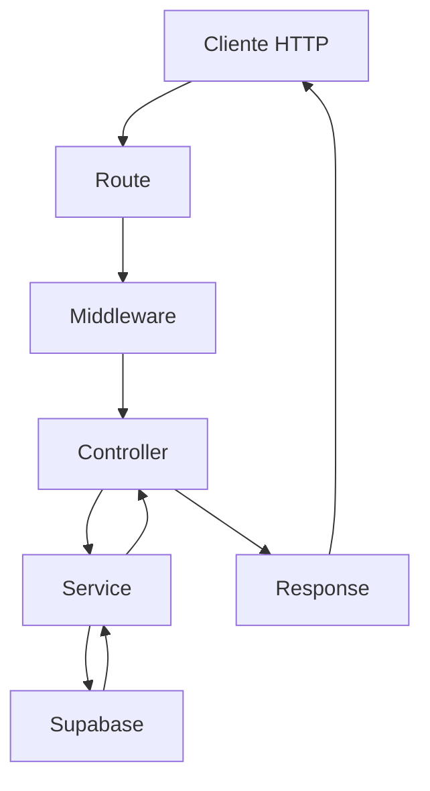

# 🏗️ Arquitetura SOA - AeroFly API

## 📋 Visão Geral

A **AeroFly API** foi desenvolvida seguindo os princípios da **Arquitetura Orientada a Serviços (SOA)**, proporcionando um sistema modular, escalável e de fácil manutenção para o gerenciamento de voos, reservas e pagamentos.

## 🎯 Princípios SOA Implementados

### 1. **Separação de Responsabilidades**
Cada componente possui uma responsabilidade específica e bem definida:

- **Controllers**: Gerenciam requisições HTTP e respostas
- **Services**: Contêm a lógica de negócio
- **Middleware**: Tratam aspectos transversais (autenticação, validação, logs)
- **Utils**: Funções auxiliares reutilizáveis

### 2. **Baixo Acoplamento**
Os serviços são independentes e se comunicam através de interfaces bem definidas, facilitando manutenção e testes.

### 3. **Alta Coesão**
Cada serviço agrupa funcionalidades relacionadas, mantendo o código organizado e compreensível.

### 4. **Reusabilidade**
Componentes podem ser reutilizados em diferentes contextos sem modificação.

## 🏛️ Estrutura da Arquitetura

```
API/
├── src/
│   ├── config/           # Configurações (Supabase, Database)
│   ├── controllers/      # Controladores HTTP
│   ├── services/         # Lógica de Negócio
│   ├── middleware/       # Middlewares
│   ├── routes/          # Definição de Rotas
│   └── utils/           # Utilitários
└── package.json
```

## 🔧 Componentes da Arquitetura

### **🎛️ Controllers**
Responsáveis por gerenciar o fluxo HTTP e validações básicas:

- `authController.js` - Autenticação e registro
- `flightController.js` - Gestão de voos
- `bookingController.js` - Reservas de passagens
- `paymentController.js` - Processamento de pagamentos
- `userController.js` - Gerenciamento de usuários

**Exemplo de Controller:**
```javascript
class FlightController {
  async searchFlights(req, res, next) {
    try {
      // Validação de entrada
      // Chamada para o serviço
      // Formatação da resposta
    } catch (error) {
      next(error);
    }
  }
}
```

### **⚙️ Services**
Contêm toda a lógica de negócio e integração com o Supabase:

- `authService.js` - Autenticação via Supabase Auth
- `flightService.js` - Busca e gerenciamento de voos
- `bookingService.js` - Criação e gestão de reservas
- `paymentService.js` - PIX e outros métodos de pagamento
- `userService.js` - Perfil e dados do usuário

**Características dos Services:**
- ✅ Integração com Supabase
- ✅ Tratamento de erros
- ✅ Logging detalhado
- ✅ Validação de dados
- ✅ Transações quando necessário

### **🛡️ Middleware**
Componentes transversais que processam requisições:

- `auth.js` - Verificação de JWT tokens
- `validation.js` - Validação de dados de entrada
- `errorHandler.js` - Tratamento global de erros

### **🛠️ Utils**
Funções auxiliares reutilizáveis:

- `helpers.js` - Funções utilitárias
- `logger.js` - Sistema de logs

## 🗄️ Integração com Supabase

### **Migração para Supabase**
A API foi migrada do PostgreSQL direto para o **Supabase**, oferecendo:

- ✅ **Autenticação Integrada**: Supabase Auth para login/registro
- ✅ **Real-time**: Capacidades de tempo real
- ✅ **RLS**: Row Level Security automático
- ✅ **API Auto-gerada**: REST e GraphQL
- ✅ **Dashboard**: Interface administrativa

### **Configuração Supabase**
```javascript
// src/config/supabase.js
const supabase = createClient(supabaseUrl, supabaseServiceKey, {
  auth: {
    autoRefreshToken: false,
    persistSession: false
  }
});
```

## 🔄 Fluxo de Dados



### **Exemplo de Fluxo - Busca de Voos:**
1. **Cliente** faz requisição GET `/flights/search`
2. **Route** direciona para `flightController.searchFlights`
3. **Middleware** valida parâmetros de busca
4. **Controller** chama `flightService.searchFlights`
5. **Service** consulta Supabase com filtros
6. **Supabase** retorna dados dos voos
7. **Service** formata dados e retorna
8. **Controller** envia resposta HTTP

## 🎨 Padrões Implementados

### **1. Repository Pattern**
Services atuam como repositories, abstraindo o acesso aos dados.

### **2. Dependency Injection**
Configuração centralizada em `config/` permite fácil troca de dependências.

### **3. Error Handling**
Tratamento consistente de erros em todas as camadas.

### **4. Logging**
Sistema de logs estruturado para monitoramento.

## 🚀 Vantagens da Arquitetura SOA

### **📈 Escalabilidade**
- Serviços podem ser escalados independentemente
- Facilita implementação de microserviços no futuro

### **🔧 Manutenibilidade**
- Código organizado e modular
- Fácil localização e correção de bugs
- Testes unitários simplificados

### **🔄 Flexibilidade**
- Fácil adição de novos recursos
- Modificação de serviços sem impacto em outros

### **👥 Colaboração**
- Equipes podem trabalhar em serviços diferentes
- Padrões consistentes facilitam onboarding

## 🧪 Testabilidade

A arquitetura facilita diferentes tipos de teste:

- **Unit Tests**: Testes isolados de services
- **Integration Tests**: Testes de fluxo completo
- **Mock Tests**: Simulação de dependências

## 📊 Monitoramento e Logs

### **Sistema de Logging**
```javascript
logger.info('User registered successfully', { 
  userId: user.id, 
  email 
});
```

### **Métricas de Performance**
- Tempo de resposta por endpoint
- Erros por serviço
- Usage patterns

## 🔐 Segurança

### **Autenticação**
- JWT tokens via Supabase Auth
- Middleware de verificação em rotas protegidas

### **Autorização**
- Row Level Security (RLS) no Supabase
- Validação de permissões por usuário

### **Validação**
- Sanitização de dados de entrada
- Validação de schemas com express-validator

## 🚀 Deploy e Produção

### **Variáveis de Ambiente**
```env
SUPABASE_URL=https://zvabuwroqlgnbgnryazd.supabase.co
SUPABASE_SERVICE_ROLE_KEY=your_service_key
NODE_ENV=production
PORT=3001
```

### **Health Checks**
- Verificação de conectividade com Supabase
- Monitoramento de recursos

## 📋 Próximos Passos

1. **Implementar Rate Limiting** mais granular
2. **Adicionar Cache** com Redis
3. **Monitoramento** com Prometheus/Grafana
4. **Documentação** OpenAPI/Swagger
5. **Testes** automatizados CI/CD
6. **Microserviços** quando necessário

---

## 🏆 Conclusão

A implementação da **Arquitetura SOA** na AeroFly API resultou em um sistema robusto, escalável e de fácil manutenção. A integração com o **Supabase** proporcionou recursos avançados de backend com simplicidade de desenvolvimento, criando uma base sólida para futuras expansões do sistema.

**Benefícios Alcançados:**
- ✅ Código organizado e modular
- ✅ Fácil manutenção e debugging
- ✅ Escalabilidade horizontal
- ✅ Reutilização de componentes
- ✅ Testabilidade aprimorada
- ✅ Segurança robusta
- ✅ Performance otimizada

A arquitetura está preparada para suportar o crescimento da aplicação e a adição de novos recursos de forma eficiente e sustentável.